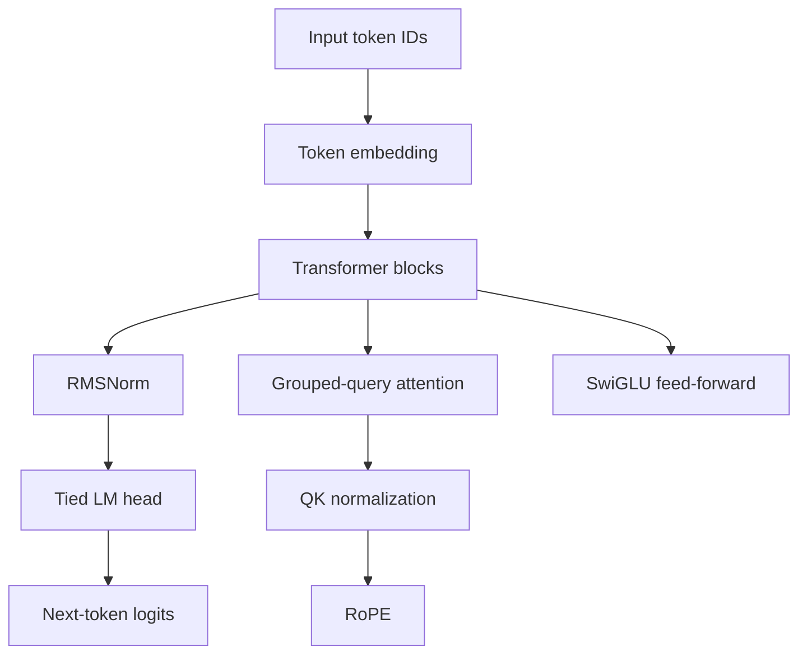

# Qwen3 From Scratch

Small Qwen3-style decoder-only language model trained from scratch with
PyTorch Lightning. Project includes:

- Grouped-query attention with rotary position embeddings
- RMSNorm and SwiGLU feed-forward blocks
- Tied token embedding and language-model head
- Muon optimizer for matrix parameters
- Bitsandbytes `int8-training` and `Adam8bit`
- Cached Hugging Face tokenization and deterministic train/validation split

This repository is an educational implementation, not an official Qwen3
checkpoint or reproduction of Qwen3 production architecture.

## Requirements

- Linux
- Python `>=3.14`
- NVIDIA GPU with CUDA for Bitsandbytes INT8 training
- Hugging Face network access on first data preparation

Install dependencies with `uv`:

```bash
uv sync
```

CPU execution is possible only after removing the Bitsandbytes plugin and
8-bit optimizer from the training path. The default configuration targets CUDA.

## Project Layout

```text
main.py                         Training entrypoint
src/configs/example.yaml        Example model and training configuration
src/data/dataset.py             Token cache and next-token dataset
src/data/dataloader.py          Lightning DataModule
src/neuralnet/                  Model architecture
src/optim/muon.py               Muon optimizer
src/trainer.py                  LightningModule and training loop
tests/                          Unit tests
```

## Training

Run configured training on one GPU:

```bash
uv run python main.py --config src/configs/example.yaml
```

Run short smoke training:

```bash
uv run python main.py \
  --config src/configs/example.yaml \
  --max-steps 10 \
  --batch-size 1 \
  --max-seq-len 256
```

Command-line overrides:

- `--config`: YAML configuration path
- `--max-steps`: training-step limit
- `--batch-size`: per-device batch size
- `--max-seq-len`: token sequence length

The entrypoint configures Lightning `BitsandbytesPrecision` with
`mode="int8-training"` and `dtype=torch.float16`. Linear weights use INT8
storage while forward and backward computation use floating point. The
non-Muon parameter group uses `bitsandbytes.optim.Adam8bit`.

## T4 Configuration

T4 GPUs provide 16 GB VRAM and support FP16, not BF16. Start with:

```yaml
batch_size: 2
max_seq_len: 512
gradient_accumulation_steps: 4
use_amp: true
device: cuda
```

If memory runs out, use batch size `1` or sequence length `256`:

```bash
uv run python main.py \
  --config src/configs/example.yaml \
  --batch-size 1 \
  --max-seq-len 256
```

`gradient_accumulation_steps` increases effective batch size without
increasing per-step activation memory.

## Data Pipeline

First run downloads the SmolLM tokenizer and streams the Cosmopedia-v2
dataset. It tokenizes up to `num_documents` documents and `max_tokens` tokens,
then writes:

```text
data_cache/tokenized_data_<num_documents>_<max_tokens>.pkl
```

Later runs reuse this cache. Cache files contain Python pickle data and should
only be loaded from trusted local sources.

Default example uses `500` documents and `500000` maximum tokens.

## Configuration

Edit `src/configs/example.yaml` for model and training settings. Important
fields:

| Field | Purpose |
| --- | --- |
| `d_model` | Hidden dimension |
| `n_layers` | Transformer block count |
| `n_heads` | Query attention heads |
| `n_kv_heads` | Key/value heads |
| `max_seq_len` | Tokens per training sample |
| `num_documents` | Documents streamed from dataset |
| `max_tokens` | Tokenization limit |
| `batch_size` | Per-device batch size |
| `max_steps` | Training-step limit |
| `gradient_accumulation_steps` | Effective batch scaling |
| `eval_every` | Validation interval |
| `eval_steps` | Validation batch limit |

`vocab_size` must remain `null` in the YAML. Data preparation fills it from
the tokenizer before model construction.

## Tests

```bash
uv run pytest -q
```

Current suite covers attention components, rotary embedding behavior, token
shifting, deterministic data splitting, and optimizer construction.

## Architecture


