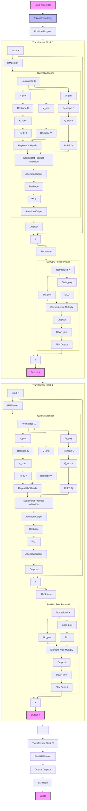

```mermaid
---
config:
  layout: elk
---

flowchart TD

    A["Input Token IDs"] --> B["Token Embedding"]
    B --> C["Position Dropout"]
    C --> TB1

    subgraph TB1["Transformer Block 1"]
        direction TB

        TB1_IN["Input X"] --> TB1_N1["RMSNorm"]
        TB1_N1 --> ATTN1

        subgraph ATTN1["Qwen3 Attention"]
            direction TB

            A1["Normalized X"]
            A1 --> Q1["Q_proj"]
            A1 --> K1["K_proj"]
            A1 --> V1["V_proj"]

            Q1 --> QR1["Reshape Q"]
            K1 --> KR1["Reshape K"]
            V1 --> VR1["Reshape V"]

            QR1 --> QN1["Q_norm"]
            KR1 --> KN1["K_norm"]

            QN1 --> RQ1["RoPE Q"]
            KN1 --> RK1["RoPE K"]

            VR1 --> KV1["Repeat KV Heads"]
            RK1 --> KV1

            RQ1 --> SDPA1["Scaled Dot-Product Attention"]
            KV1 --> SDPA1

            SDPA1 --> AO1["Attention Output"]
            AO1 --> RO1["Reshape"]
            RO1 --> WO1["W_o"]
            WO1 --> ATTNO1["Attention Output"]
        end

        ATTNO1 --> D1["Dropout"]
        TB1_IN --> ADD1["+"]
        D1 --> ADD1

        ADD1 --> TB1_N2["RMSNorm"]
        TB1_N2 --> FF1

        subgraph FF1["SwiGLU FeedForward"]
            direction TB

            FFI1["Normalized X"]
            FFI1 --> GP1["Gate_proj"]
            FFI1 --> UP1["Up_proj"]

            GP1 --> SILU1["SiLU"]
            SILU1 --> MUL1["Element-wise Multiply"]
            UP1 --> MUL1

            MUL1 --> DO1["Dropout"]
            DO1 --> DP1["Down_proj"]
            DP1 --> FFO1["FFN Output"]
        end

        FFO1 --> ADD2["+"]
        ADD1 --> ADD2
        ADD2 --> TB1_OUT["Output X"]
    end

    TB1 --> TB2

    subgraph TB2["Transformer Block 2"]
        direction TB

        TB2_IN["Input X"] --> TB2_N1["RMSNorm"]
        TB2_N1 --> ATTN2

        subgraph ATTN2["Qwen3 Attention"]
            direction TB

            A2["Normalized X"]
            A2 --> Q2["Q_proj"]
            A2 --> K2["K_proj"]
            A2 --> V2["V_proj"]

            Q2 --> QR2["Reshape Q"]
            K2 --> KR2["Reshape K"]
            V2 --> VR2["Reshape V"]

            QR2 --> QN2["Q_norm"]
            KR2 --> KN2["K_norm"]

            QN2 --> RQ2["RoPE Q"]
            KN2 --> RK2["RoPE K"]

            VR2 --> KV2["Repeat KV Heads"]
            RK2 --> KV2

            RQ2 --> SDPA2["Scaled Dot-Product Attention"]
            KV2 --> SDPA2

            SDPA2 --> AO2["Attention Output"]
            AO2 --> RO2["Reshape"]
            RO2 --> WO2["W_o"]
            WO2 --> ATTNO2["Attention Output"]
        end

        ATTNO2 --> D2["Dropout"]
        TB2_IN --> ADD3["+"]
        D2 --> ADD3

        ADD3 --> TB2_N2["RMSNorm"]
        TB2_N2 --> FF2

        subgraph FF2["SwiGLU FeedForward"]
            direction TB

            FFI2["Normalized X"]
            FFI2 --> GP2["Gate_proj"]
            FFI2 --> UP2["Up_proj"]

            GP2 --> SILU2["SiLU"]
            SILU2 --> MUL2["Element-wise Multiply"]
            UP2 --> MUL2

            MUL2 --> DO2["Dropout"]
            DO2 --> DP2["Down_proj"]
            DP2 --> FFO2["FFN Output"]
        end

        FFO2 --> ADD4["+"]
        ADD3 --> ADD4
        ADD4 --> TB2_OUT["Output X"]
    end

    TB2 --> MORE["⋮"]
    MORE --> TBN["Transformer Block N"]

    TBN --> FINAL_NORM["Final RMSNorm"]
    FINAL_NORM --> OUTPUT_DROPOUT["Output Dropout"]
    OUTPUT_DROPOUT --> LM_HEAD["LM Head"]
    LM_HEAD --> LOGITS["Logits"]

    style A fill:#f9f,stroke:#333,stroke-width:2px
    style B fill:#bbf,stroke:#333,stroke-width:2px
    style TB1_OUT fill:#f9f,stroke:#333,stroke-width:2px
    style TB2_OUT fill:#f9f,stroke:#333,stroke-width:2px
    style LOGITS fill:#f9f,stroke:#333,stroke-width:2px
```